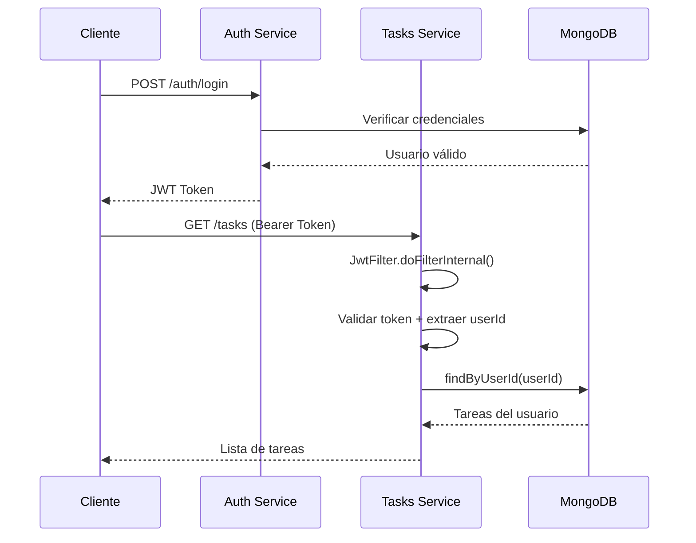

# 📋 TaskManager API

<div align="center">


*API REST de microservicios para gestión básica de tareas con autenticación JWT*

[ API](#-api-endpoints) • [ Instalación](#-instalación-rápida) • [ Configuración](#️-configuración) • [ Testing](#-testing) • [ Roadmap](#-roadmap)

</div>

---

## ✨ Funcionalidades

### 🔑 **Auth Service (auth-svc)**

* **Registro de usuarios** (username, email y contraseña)
* **Login con bloqueo** - 5 intentos fallidos → bloqueo 15 minutos
* **JWT HS256** - Emisión con `sub` (userId), `iss`, `iat`, `exp`
* **BCrypt hashing** - Contraseñas hasheadas de forma segura
* **Validaciones robustas** - Spring Validation integrado
* **Dockerizado** - Multi-stage build optimizado
* **MongoDB integration** - Persistencia con auditoría automática

### 📌 **Tasks Service (tasks-svc)**

* **CRUD completo** - Crear, leer, actualizar y eliminar tareas
* **Filtrado avanzado** - Por estado, prioridad, etiquetas y fechas de creación
* **Paginación** - En listados de tareas con Spring Data
* **Autenticación JWT** - Filtro JWT integrado con Bearer token
* **Multi-usuario** - Separación por usuario mediante JWT claims
* **Gestión de estados** - PENDING, IN\_PROGRESS, DONE
* **Sistema de etiquetas** - Para categorizar tareas
* **Fechas de vencimiento** - Con validaciones temporales
* **Estimación de tiempo** - En minutos (1-1440)
* **Serialización custom** - Formato JSON optimizado para paginación

## Arquitectura

```
TaskManager/
├── auth-svc/              #  Microservicio de autenticación (Puerto 8083)
│   ├── src/main/java/     # Código fuente Java 21
│   │   ├── controller/    # AuthController - endpoints REST
│   │   ├── service/       # AuthService + JwtService
│   │   ├── domain/        # User entity con auditoría
│   │   ├── dto/           # Login/Register DTOs con validación
│   │   ├── repository/    # UserRepository MongoDB
│   │   └── config/        # SecurityConfig con BCrypt
│   ├── Dockerfile         # Multi-stage build
│   └── .env               # Variables de entorno
├── tasks-svc/             #  Microservicio de tareas (Puerto 8080)
│   ├── src/main/java/     # Código fuente Java 17
│   │   ├── controller/    # TaskController con autenticación JWT
│   │   ├── service/       # TaskService con filtros avanzados
│   │   ├── domain/        # Task entity con timestamps
│   │   ├── DTO/           # CreateTask/UpdateTask DTOs
│   │   ├── repository/    # TaskRepository MongoDB
│   │   ├── security/      # JwtFilter - autenticación por token
│   │   ├── config/        # SecurityConfig + PageSerializer
│   │   └── exceptions/    # GlobalExceptionHandler
│   ├── Dockerfile         # Multi-stage build
│   └── .env               # Variables de entorno
├── compose.yaml           # Orquestación Docker
├── .env                   # Variables globales (BBDD)
├── TaskManager.postman_collection.json  #Colección de pruebas
└── .github/workflows/     # CI/CD con GitHub Actions
```

**Stack Tecnológico:**

* **Java 21** (auth-svc) | **Java 17** (tasks-svc) - Lenguajes principales
* **Spring Boot 3.5.4** - Framework web y microservicios
* **Spring Data MongoDB** - Persistencia NoSQL con auditoría
* **Spring Security** - JWT Filter custom + BCrypt
* **JWT (jjwt 0.11.5)** - Autenticación stateless
* **Lombok** - Reducción de boilerplate
* **Docker + Docker Compose** - Contenedorización
* **OpenAPI 3** - Documentación automática
* **Maven Wrapper** - Build tool

---

## Instalación Rápida

### Con Docker Compose

```bash
# 1. Clonar el repositorio
git clone https://github.com/SantiagoDt/TaskManager.git
cd TaskManager

# 2. Configurar variables de entorno
cp .env.example .env                   
cp auth-svc/.env.example auth-svc/.env  
cp tasks-svc/.env.example tasks-svc/.env

# 3. Levantar todos los servicios
docker compose up -d

# 4. Verificar estado
docker compose ps
```

> \[!TIP]
> **Las imágenes se descargan automáticamente** desde Docker Hub (`santiagodt/auth-svc:0.0.1` y `santiagodt/tasks-svc:0.0.1`). No necesitas construirlas localmente.

**Servicios disponibles:**

* **Auth Service** → [http://localhost:8083](http://localhost:8083)
* **Tasks Service** → [http://localhost:8080](http://localhost:8080)
* **Mongo Express** → [http://localhost:8081](http://localhost:8081)

### Desarrollo Local

```bash
# Levantar MongoDB
docker compose up mongo mongo-express -d

# Auth Service
cd auth-svc
./mvnw spring-boot:run

# Tasks Service (en otra terminal)
cd tasks-svc
./mvnw spring-boot:run
```

---

## Configuración

### Variables de Entorno

#### `.env` (raíz del proyecto - BBDD)

```env
# === MONGODB GLOBAL ===
MONGO_USER=admin
MONGO_PASS=securepass2024
ME_USER=dbadmin
ME_PASS=dbadmin2024
```

#### `auth-svc/.env` (Auth Service)

```env
# === SERVICE CONFIG ===
AUTH_PORT=8083

# === MONGODB CONNECTION ===
MONGO_HOST=mongo
MONGO_PORT=27017
MONGO_DB=userdb
MONGO_USER=admin
MONGO_PASS=securepass2024
MONGO_AUTHDB=admin

# === JWT CONFIGURATION ===
JWT_SECRET=tu_jwt_secret_minimo_32_caracteres_aqui
JWT_EXPIRATION=120
JWT_ISSUER=auth-svc
JWT_AUDIENCES=tasks-svc
```

#### `tasks-svc/.env` (Tasks Service)

```env
# === MONGODB CONNECTION ===
MONGO_HOST=mongo
MONGO_PORT=27017
MONGO_DB=tasksdb
MONGO_USER=admin
MONGO_PASS=securepass2024
MONGO_AUTHDB=admin

# === JWT CONFIGURATION ===
JWT_SECRET=tu_jwt_secret_minimo_32_caracteres_aqui

# === MONGO EXPRESS CONFIG ===
ME_USER=dbadmin
ME_PASS=dbadmin2024
```

> \[!IMPORTANT]
> **JWT\_SECRET**: Debe ser el mismo en ambos servicios y tener al menos 32 caracteres para HS256.
> **Puertos**: auth-svc (8083), tasks-svc (8080), mongo (27017), mongo-express (8081)

---

## API Endpoints

### Auth Service (puerto 8083)

| Método | Endpoint         | Descripción             | Autenticación |
| ------ | ---------------- | ----------------------- | ------------- |
| `POST` | `/auth/register` | Registrar nuevo usuario | No requerida  |
| `POST` | `/auth/login`    | Login y obtener JWT     | No requerida  |

#### Registro de Usuario

```bash
curl -X POST http://localhost:8083/auth/register \
  -H "Content-Type: application/json" \
  -d '{
    "username": "santiago",
    "email": "santi@example.com",
    "password": "supersecret123"
  }'
```

#### Login y JWT

```bash
curl -X POST http://localhost:8083/auth/login \
  -H "Content-Type: application/json" \
  -d '{
    "email": "santi@example.com",
    "password": "supersecret123"
  }'
```

**Respuesta de Login:**

```json
{
  "message": "Login successful",
  "username": "santiago",
  "email": "santi@example.com",
  "lastLoginAt": "2025-01-11T11:18:30.569Z",
  "token": "eyJhbGciOiJIUzI1NiJ9.eyJzdWIiOiI2NmUxY..."
}
```

---

### Tasks Service (puerto 8080)

| Método   | Endpoint      | Descripción               | Autenticación    |
| -------- | ------------- | ------------------------- | ---------------- |
| `POST`   | `/tasks`      | Crear nueva tarea         | `Bearer <token>` |
| `GET`    | `/tasks/{id}` | Obtener tarea específica  | `Bearer <token>` |
| `GET`    | `/tasks`      | Listar tareas con filtros | `Bearer <token>` |
| `PATCH`  | `/tasks/{id}` | Actualizar tarea          | `Bearer <token>` |
| `DELETE` | `/tasks/{id}` | Eliminar tarea            | `Bearer <token>` |

#### Flujo Completo: Login → Crear Tarea

```bash
# 1. Obtener token JWT
TOKEN=$(curl -s -X POST http://localhost:8083/auth/login \
  -H "Content-Type: application/json" \
  -d '{"email":"santi@example.com","password":"supersecret123"}' \
  | jq -r '.token')

# 2. Crear tarea usando el token
curl -X POST http://localhost:8080/tasks \
  -H "Content-Type: application/json" \
  -H "Authorization: Bearer $TOKEN" \
  -d '{
    "title": "Revisar código",
    "description": "Code review del PR #42",
    "tags": ["code-review", "urgent"],
    "priority": "HIGH",
    "dueAt": "2025-01-15T17:00:00Z",
    "estimatedMinutes": 60
  }'
```

#### 🔍 Filtrar Tareas con Paginación

```bash
curl "http://localhost:8080/tasks?status=PENDING&priority=HIGH&page=0&size=5&sort=createdAt,desc" \
  -H "Authorization: Bearer $TOKEN"
```

**Parámetros de filtrado disponibles:**

* `status` - PENDING, IN\_PROGRESS, DONE
* `priority` - LOW, MEDIUM, HIGH
* `tags` - Lista de etiquetas
* `createdFrom` / `createdTo` - Rango de fechas ISO
* `page`, `size`, `sort` - Paginación Spring Data

---

## Modelo de Datos

### Usuario (auth-svc)

```json
{
  "id": "66e1c...",
  "username": "santiago",
  "email": "santi@example.com",
  "passwordHash": "$2a$10$...",
  "role": "USER",
  "isEmailVerified": false,
  "failedLoginAttempts": 0,
  "accountLockedUntil": null,
  "lastLoginAt": "2025-01-11T10:00:00Z",
  "createdAt": "2025-01-10T10:00:00Z",
  "updatedAt": "2025-01-11T10:00:00Z"
}
```

### Tarea (tasks-svc)

```json
{
  "id": "66e1d...",
  "userId": "66e1c...",
  "title": "Completar documentación",
  "description": "Escribir README del proyecto",
  "tags": ["documentation", "readme"],
  "priority": "MEDIUM",
  "status": "PENDING",
  "position": null,
  "dueAt": "2025-01-15T18:00:00Z",
  "estimatedMinutes": 60,
  "createdAt": "2025-01-10T10:00:00Z",
  "updatedAt": "2025-01-10T10:00:00Z",
  "finishedAt": null
}
```

---

## Documentación Interactiva

### URLs Disponibles

* **Tasks Swagger UI**: [http://localhost:8080/swagger-ui/index.html](http://localhost:8080/swagger-ui/index.html)
* **Auth Swagger UI**: [http://localhost:8083/swagger-ui/index.html](http://localhost:8083/swagger-ui/index.html)
* **Tasks OpenAPI**: [http://localhost:8080/v3/api-docs](http://localhost:8080/v3/api-docs)
* **Auth OpenAPI**: [http://localhost:8083/v3/api-docs](http://localhost:8083/v3/api-docs)
* **Mongo Express**: [http://localhost:8081](http://localhost:8081)

---

## Validaciones Implementadas

### Auth Service

* **Username**: 3-20 caracteres, obligatorio
* **Email**: Formato válido, obligatorio, único en BD
* **Password**: Mínimo 10 caracteres, obligatorio
* **Login**: Máximo 5 intentos (bloqueo 15 min)
* **BCrypt**: Hash seguro de contraseñas

### Tasks Service

* **Título**: Obligatorio, máximo 20 caracteres
* **Descripción**: Opcional, máximo 200 caracteres
* **Fecha vencimiento**: Presente o futura (`@FutureOrPresent`)
* **Minutos estimados**: Entre 1 y 1440 (24 horas)
* **Estados**: PENDING, IN\_PROGRESS, DONE
* **Prioridades**: LOW, MEDIUM, HIGH
* **JWT**: Token válido y no expirado obligatorio

---

## Manejo de Errores

### Respuestas de Error Estructuradas

```json
{
  "type": "about:blank",
  "title": "Validation failed",
  "status": 400,
  "detail": "Request body has invalid fields.",
  "instance": "/tasks",
  "errors": {
    "title": "Title can have at most 20 characters",
    "estimatedMinutes": "estimatedMinutes must be at least 1"
  }
}
```

**Códigos HTTP implementados:**

* `400` - Validación fallida, JSON malformado
* `401` - JWT inválido, expirado o faltante
* `404` - Recurso no encontrado o sin acceso
* `500` - Error interno del servidor

---

## Testing

### Con Postman

#### Características de la colección:

* **Variables de entorno** pre-configuradas
* **Flujo automatizado** de autenticación (login → guardar token)
* **Todos los endpoints** con ejemplos de datos
* **Tests automatizados** en cada request
* **Datos de prueba** listos para usar

#### Variables incluidas:

```json
{
  "auth_base": "http://localhost:8083",
  "task_base": "http://localhost:8080",
  "token": "{{auto-generated}}",
  "task_id": "{{auto-extracted}}"
}
```

#### Requests incluidas:

**Auth Service:**

* `POST` Registro de usuario
* `POST` Login (guarda token automáticamente)

**Tasks Service:**

* `POST` Crear tarea (guarda ID automáticamente)
* `GET` Listar tareas con filtros
* `GET` Obtener tarea por ID
* `PATCH` Actualizar tarea
* `DELETE` Eliminar tarea

> \[!TIP]
> **Uso rápido**: Importa la colección → Ejecuta "Login" → Los demás requests ya tienen el token configurado automáticamente.

### Tests de Código

```bash
# Tests auth-svc
cd auth-svc
./mvnw test

# Tests tasks-svc con validaciones
cd tasks-svc  
./mvnw test
```

## CI/CD

### GitHub Actions

* **Build automático** en push/PR a `main`
* **Testing** con MongoDB en contenedor
* **Multi-service** build para ambos microservicios
* **Reports** de tests como artefactos

Ver: [`.github/workflows/ci.yml`](.github/workflows/ci.yml)

---

## Roadmap

### **Completado**

* [x] **Auth Service** - Registro, login, JWT con BCrypt
* [x] **Tasks CRUD** - Operaciones completas de tareas
* [x] **JWT Integration** - Filtro JWT en tasks-svc con Bearer token
* [x] **Docker Compose** - Orquestación de microservicios
* [x] **Validaciones** - Spring Validation en ambos servicios
* [x] **MongoDB** - Persistencia con Mongo Express UI
* [x] **OpenAPI Docs** - Swagger UI automático
* [x] **Error Handling** - GlobalExceptionHandler con Problem Detail
* [x] **Pagination** - Spring Data con serialización custom
* [x] **CI/CD** - GitHub Actions con tests automatizados
* [x] **Docker Hub** - Imágenes publicadas y disponibles
* [x] **Postman Collection** - Testing automatizado completo

### **En Desarrollo**

* [ ] **Ampliación de excepciones** - GlobalExceptionHandler con Problem Detail

---

## Arquitectura de Seguridad

### Flujo JWT



### Características de Seguridad

* **Stateless JWT** - No sesiones en servidor
* **HS256 Signing** - Clave simétrica compartida
* **Request Filtering** - Validación en cada request
* **User Isolation** - Tareas por usuario automático
* **Password Hashing** - BCrypt con salt
* **Account Locking** - Protección anti brute-force

---

## 🤝 Contribuir

1. **Fork** el repositorio
2. **Crea** tu feature branch (`git checkout -b feature/NuevaFeature`)
3. **Commit** tus cambios (`git commit -m 'Agregar nueva funcionalidad'`)
4. **Push** al branch (`git push origin feature/NuevaFeature`)
5. **Abre** un Pull Request

---

<div align="center">

**Hecho con ❤️ por [Santiago](https://github.com/SantiagoDt)**

</div>
